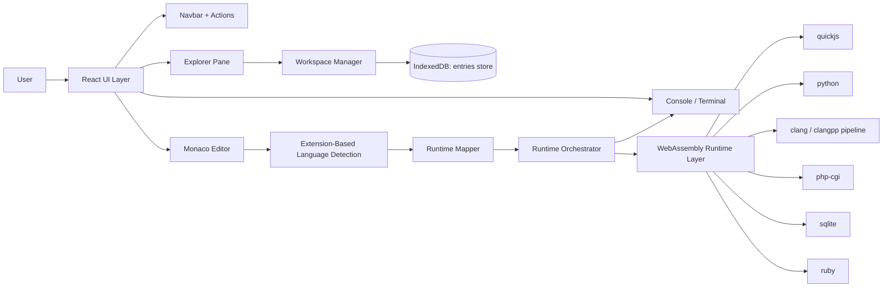

# NimbusCode Project Documentation

> Note: For final submission, set document font size to **18px** in your editor/export settings.

## Abstract

NimbusCode is a frontend-only, browser-based coding environment designed to reduce entry barriers for programming learners. Traditional coding setups require local runtime installation, compiler configuration, and dependency management. NimbusCode removes this complexity by running supported languages directly in the browser through WebAssembly-backed execution.  

The platform provides an integrated interface with a file explorer, tabbed editor, runtime-aware execution pipeline, and output console. It supports multiple languages including JavaScript, Python, C, C++, PHP, SQLite, and Ruby. User files are persisted locally using IndexedDB, which eliminates server-side storage requirements and keeps the architecture lightweight.  

The system demonstrates that a browser-only IDE can deliver practical code execution and learning workflows without backend infrastructure. This makes NimbusCode especially suitable for education, labs, demonstrations, and beginner programming environments.

## Introduction

Programming education is often slowed by tooling and environment setup before students can write their first executable program. Installing language runtimes, configuring compilers, and resolving system-specific issues can be difficult for beginners and time-consuming for institutions.  

NimbusCode addresses this by providing a web-based code editor and execution interface where users can immediately create files and run programs. The core design principles are:

1. No backend dependency for execution.
2. Minimal setup for the learner.
3. Language support through browser-compatible runtimes.
4. Persistent local workspace for continuity.

The project was implemented using React + TypeScript with Bun and Vite. The execution model uses WebAssembly-compatible runtime mechanisms for supported languages and a console-style output experience. The application structure is inspired by modern IDE workflows but optimized for accessibility and simplicity.

## Architecture Diagram



## Methodology

### 1. Requirement Analysis

- Define an IDE-like interface with zero backend.
- Support file operations (create/open/delete).
- Enable multi-language execution from one editor.
- Persist user workspace locally.

### 2. System Design

- Use split-pane layout for explorer, editor, and console.
- Detect language/runtime from file extension.
- Route execution through runtime-specific handlers.
- Maintain clear separation between UI state and persistence layer.

### 3. Implementation

- Build UI with React and TypeScript.
- Integrate Monaco Editor for coding interface.
- Implement workspace persistence via IndexedDB.
- Add runtime execution integration for supported languages.
- Add settings tab and language metadata display.

### 4. Testing and Verification

- Validate file lifecycle: create, edit, delete, reload.
- Validate tab behavior: open, activate, close.
- Validate runtime execution across supported extensions.
- Validate output and error visibility in console.
- Run lint and production build checks.

### 5. Iterative Enhancement

- Improve UI consistency and icon usage.
- Add settings panel scaffolding for editor preferences.
- Add language-specific syntax completions.
- Improve console behavior and reduce duplicate error display.

## Form Design

The application does not use traditional database-backed web forms. Instead, it uses interactive UI controls that function as operational forms.

### A. File/Folder Creation Input (Explorer)

- Inline input appears directly in the explorer tree.
- User types file or folder name and presses Enter to create.
- Creation cancels on focus loss or Escape.
- No browser prompt is used.

### B. Settings Panel (Settings Tab)

- Keybindings selector:
  - Default
  - Vim
  - Emacs
- Completions toggle:
  - Sliding switch UI
  - Currently serves as editor option + provider toggle control

### C. Execution Controls

- Run button triggers code execution for active file.
- Console clear button resets visible output area.
- Language chip opens supported language list.

## Schema Structure

NimbusCode uses IndexedDB for local storage.  
Database model:

- Database name: `nimbuscode-workspace`
- Object store: `entries`
- Key path: `path`

### Entry Types

#### 1. File Entry

```json
{
  "path": "/example/main.py",
  "kind": "file",
  "content": "print('Hello')\n",
  "updatedAt": 1739999999999
}
```

#### 2. Folder Entry

```json
{
  "path": "/example",
  "kind": "folder",
  "updatedAt": 1739999999999
}
```

### Storage Operations

- `listWorkspaceEntries()`: Fetch and sort entries by path.
- `putWorkspaceEntries(entries)`: Insert/update entries.
- `deleteWorkspacePaths(paths)`: Remove one or more paths.

This schema is intentionally lightweight and sufficient for a local-first educational IDE.

## Experimental Results

The implemented system was evaluated using functional and usability-oriented checks.

### Functional Validation Summary

| Area | Result |
|---|---|
| Explorer create/delete flow | Passed |
| Tabbed editor behavior | Passed |
| Runtime mapping by extension | Passed |
| Output/error visibility in console | Passed |
| Local persistence after reload | Passed |
| Build and lint verification | Passed |

### Observed Outcomes

1. Users can begin coding immediately without installing compilers/interpreters.
2. Runtime selection based on extension works consistently.
3. UI workflow resembles familiar desktop IDE behavior, reducing learning friction.
4. Local persistence enables continuity between sessions.

### Known Constraints

- Heavy runtime tasks may take longer on low-resource devices.
- Browser limitations can affect very long-running programs.
- Semantic LSP-level intelligence is intentionally limited in current scope.

## Scope for Future Enhancement

1. Implement fully functional keybinding profiles (Vim/Emacs behavior).
2. Add advanced diagnostics and lint overlays per language.
3. Add execution cancellation/interrupt controls for long-running programs.
4. Improve SQL workflow with richer interactive query helpers.
5. Add import/export of workspace snapshots (JSON or zipped project).
6. Add optional cloud sync mode while keeping local-first as default.
7. Add accessibility enhancements (keyboard navigation and reader semantics).

## Conclusion

NimbusCode demonstrates that a practical coding environment can be delivered entirely in the browser using a local-first, WebAssembly-enabled architecture. The project successfully combines editor usability, runtime integration, and persistent workspace management without backend complexity.  

For academic and beginner-focused environments, this approach significantly lowers setup friction and helps learners focus on programming logic rather than toolchain installation. With incremental enhancements in diagnostics, editor controls, and workflow features, the system can evolve from an educational prototype into a robust browser IDE platform.
