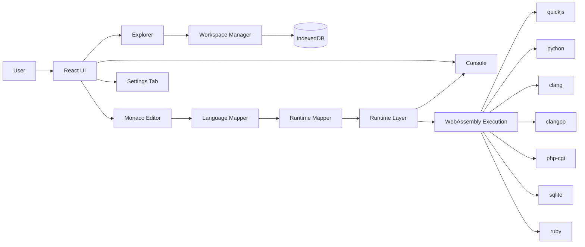

# NimbusCode PPT Content

## Abstract

NimbusCode is a browser-based coding environment that removes the need for local compiler/runtime installation. It enables students to create files, write code, and execute programs directly in the browser using WebAssembly-backed runtimes. The project is designed as a frontend-only system, with no backend dependency for code execution or storage. Workspace data is persisted locally through IndexedDB. This approach improves accessibility and reduces setup overhead in academic programming environments.

## Introduction

Programming beginners often face environment setup issues before they can start learning core concepts. NimbusCode addresses this challenge by offering an IDE-like interface in the browser with multi-language support, file management, and runtime execution.

### I. Problem Statement

Traditional programming workflows require:

1. Installing language runtimes and compilers.
2. Managing OS-specific toolchain differences.
3. Resolving dependency and PATH issues.
4. Maintaining development environments across lab systems.

These steps increase friction and reduce learning focus.

### II. Motivation

The project is motivated by the need to:

1. Minimize setup time for students.
2. Provide a consistent environment across devices.
3. Enable quick experimentation for multiple languages.
4. Build a lightweight educational coding platform without backend complexity.

## Architecture Diagram

## Methodology

1. Analyze educational requirements for a no-setup coding platform.
2. Design modular frontend architecture (explorer, editor, runtime, console).
3. Implement extension-based runtime mapping.
4. Integrate local workspace persistence using IndexedDB.
5. Add tabbed editor and settings tab for UX parity with modern IDE patterns.
6. Add syntax-level language completions and validate execution behavior.
7. Perform lint/build checks and iterative UI/runtime fixes.

## Results

1. Frontend-only code execution across multiple languages achieved.
2. IDE-like workflow implemented: file explorer, tabs, run, console.
3. Runtime/language detection via file extension implemented.
4. Local data persistence across sessions implemented.
5. Error handling consolidated into console for clearer runtime feedback.

## Evaluation and Comparison/ Validation

### Validation

1. File operations: create/open/delete and reload persistence verified.
2. Execution pipeline: runtime mapping and output rendering verified.
3. UI workflow: tab behavior and settings tab flow verified.
4. Quality checks: lint and production build pass.

### Comparison (Conceptual)

Compared to traditional local IDE setup:

1. Setup overhead: significantly reduced.
2. Environment consistency: higher (browser-standardized).
3. Infrastructure need: lower (no backend required).
4. Advanced tooling depth: currently lower than full desktop IDEs.

## Scope for Future Enhancement

1. Functional keybinding engines (Vim/Emacs).
2. Rich diagnostics and per-language linting overlays.
3. Execution interrupt/timeout controls.
4. Workspace import/export and optional sync.
5. Enhanced SQL interactivity and query helpers.
6. Broader language tooling and semantic assistance.

## Conclusion

NimbusCode successfully demonstrates a no-backend, WebAssembly-based educational coding environment that reduces setup friction and improves accessibility for learners. The project provides a stable foundation with practical multi-language execution and local persistence. With incremental improvements in tooling and diagnostics, it can evolve into a stronger browser-native IDE platform for academic use.
